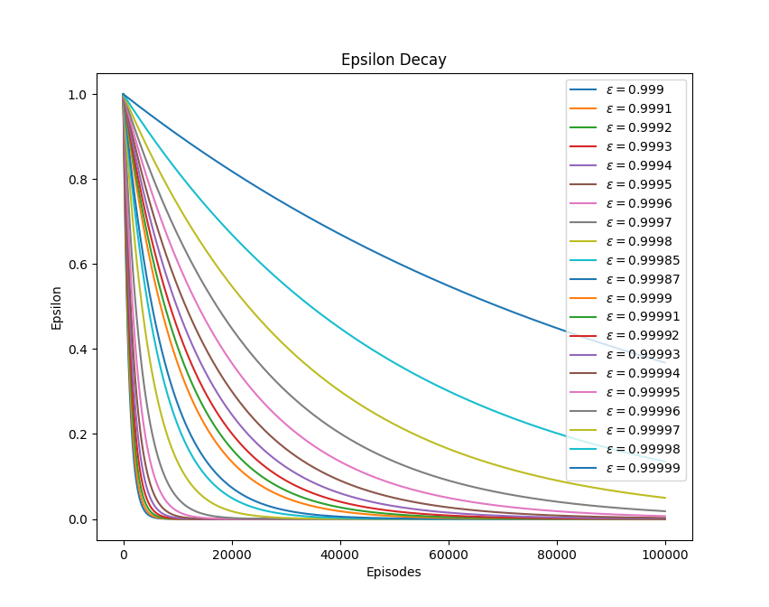
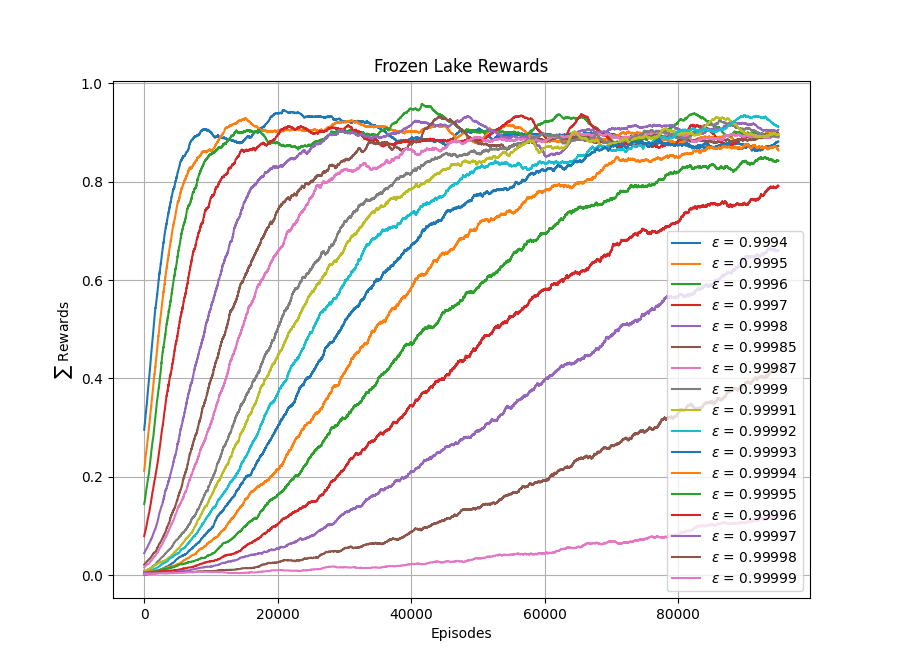

# Projeto para testar uma implementação para o FrozenLake 8x8

Considere o ambiente FrozenLake 8x8 versão não-determinística. Implemente um agente capaz de chegar ao objetivo final em pelo menos 80% das vezes. Para implementar este agente você pode utilizar o algoritmo *Q-Learning* ou *Sarsa* com os hiperparâmetros que você considerar melhor. 

Você deve adicionar neste projeto e fazer o commit dos seguintes artefatos: 

* o arquivo `q-table.csv` dentro do diretório `data`. Já existe um arquivo q-table neste projeto, mas ele é para a versão do ambiente 4x4. Quando você executar o arquivo `test_frozenlake.py` usando o comando `pytest`irá ocorrer um erro de `IndexError`. Você deve substituir este arquivo pelo arquivo gerado pelo seu agente durante o período de treinamento; 

* depois de substituir o arquivo `data/q-table.csv`, você poderá executar os testes e verificar se o mesmo é aprovado em todos os testes. São quatro testes: o primeiro executa o ambiente 1000 vezes e verifica se o agente conseguiu chegar ao final em no mínimo 700 vezes. Os outros 3 testes fazem exatamente a mesma coisa: executam o agente no ambiente 1000 vezes e verificam se o agente conseguiu chegar ao final em no mínimo 800 vezes;

* você também deve adicionar a sua implementação no diretório raiz deste projeto, e;

* alterar este arquivo README.md informando os hiperparâmetros utilizados para o treinamento. 

* (critério para A+) apresentar um gráfico comparando a curva de aprendizagem de diversas abordagens utilizadas durante o treinamento. 

## Algoritmo e hiperparâmetros utilizados para o treinamento

| Atributo        |  Valor     |
|:----------------|:----------:|
| Algoritmo       |            |
| alpha           |            |
| gamma           |            |
| epsilon         |            |
| epsilon_dec     |            |
| epsilon_min     |            |
| qtd_episodios   |            |

## Comparação entre abordagens

O Q-learning foi o algorítimo escolhido por ser de característica off-policy, atualizando seu resultado de acordo com a política ótima e por se tratar de um ambiente estocástico. Vamos aprofundar o processo de ajuste dos hiperparâmetros do algoritmo Q-learning para melhorar seu desempenho na resolução do ambiente FrozenLake com o objetivo de atingir pelo menos 80% de eficiencia. Primeiramente foram fixados os seguintes parametros:

* $\alpha = 0.1$

* $\gamma = 0.99$

* $\epsilon = 0.9999$

* $\epsilon_{min} = 0.0001$

* $E = 100000$

Em seguida, um gráfico foi plotado de modo a vizualizar o decaimento do parametro $\epsilon$ para diferentes $\epsilon_{dec}$ ao longo dos episodios de treinamento.

<!-- O gráfico ajuda a visualizar o efeito de diferentes valores de epsilon na compensação exploration-explotation durante o processo de Q-learning. Um valor mais alto de epsilon significa que o algoritmo tem mais chances de explorar o ambiente selecionando ações aleatórias, enquanto um valor mais baixo de epsilon significa que o algoritmo tem mais chances de explorar os valores Q aprendidos selecionando a ação com o valor Q mais alto.

Além disso, mostra que, à medida que o epsilon diminui ao longo do tempo, o algoritmo se concentra mais em explorar os valores Q aprendidos, o que pode levar a um desempenho melhor na tarefa. No entanto, um valor baixo de epsilon pode fazer com que o algoritmo fique preso em um ótimo local e perca o ótimo global. Portanto, é essencial equilibrar a exploração e a "exploitação" escolhendo um valor apropriado de $\epsilon_{dec}$. -->

O grafico nos permite vizualizar para varios valores de $\epsilon_{dec}$, qual a curva que controla a diminuiçao da probailidade de exploração, para valores menores de $\epsilon_{dec}$, a diminuição é brusca, fazendo com que durante o treinamento, o modelo pare de explorar logo nos primeiros episodios, e conforme $\epsilon_{dec}$ aumenta, o decaimento de $\epsilon$ fica gada vez mais gradual.

### Treinamento

Para valores de $\epsilon_{dec}$ inferiores a $0.9994$ o algoritimo parecia estar preso em um otimo local, uma vez que o tempo de treinamento estava extremamente alto e nao havia convergencia. A partir de $0.9994$, o treinamento parecia convergir na terceira ou quarta tentativa, conforme $\epsilon_{dec}$ aumentava, a probabilidae de convergencia tambem aumentava. Dessa forma, foi plotado um gráfico dos treinamentos convergentes a partir de $0.9994$:

Neste gráfico podemos observar que para valores menores de $\epsilon_{dec}$ o apredizado ocorria de forma mais rapida, convergindo rapidamente para uma efciencia maior que 0.8, este comportamento se sucedeu até $\epsilon_{dec} = 0.99995$ diminuindo gradualmente a velocidade do aprendizado. Para o valor de $\epsilon_{dec} = 0.99996$ o modelo da a entender que convergiria em uma taxa maior que 0.8 se mais episodios de simulação fossem alocaodos, para os demais nao há como prever se houve convergencia, e se caso houvesse em qual taxa de eficiencia convirgiria, para os 100000 episodios.

### Eficiencia

Entretanto, um modelo que aprendeu rapidamente nao implica em uma eficiencia proporcional a sua rapidez de aprendizado. Portanto, para os modelos treinados, foram coletadas 100 amostras de 1000 simulações cada para cada modelo, de modo a observarmos seu reward maximo, médio e minimo. Assim, teremos uma métrica real para medir a eficiencia do modelo. Lembrando que, estamos considerando como eficiencia o simples fato do algorítimo passar no teste, não correspondendo necessariamente ao numero minimo de ações para vencer no ambiente FrozenLake. Em outras palavras, o grafico asseguir mede o quao eficiente é cada modelo em simplesmente vencer o ambiente:

Surpreendentemente, o modelo cujo $\epsilon_{dec} = 0.99996$ apresentou o melhor desempenho nos testes, uma vez que durante o treinamento este modelo não finalizou as simulação convergindo $>=0.8$. O modelo teve uma média de eficiencia extremamente alta, quase com 100% em um ambiente não deterministico

### Comentarios e Hipoteses de Melhoria

* Foram realizadas 100 amostras, e cada amostra analizava 1000 simulações, no total 100000 simulações por modelo, ou seja, acredito que seja improvavel um viés de amostragem para este caso. Entretanto, é apenas uma hipotese, uma vez que seria necessario uma análise da distribuição probabilistica focada no contexto em questão para afirmarmos algo do tipo.

* Outra hipotese seria devido ao fato justamente de estarmos lidando com um ambiente estocástico, ou seja, mesmo que treinemos duas vezes o mesmo algorítimo com os mesmos parametros, é improvavel que o modelo apresente a mesma curva de aprendizado e desempenho. Assim esta versão do modelo treinada por sorte gerou uma q-table muito boa para resolver o ambiente FrozenLake mas que pode ser um outlier. Pretendo realizar diferentes treinamentos com os mesmos parametros para compreender melhor esta hipotese.

* Os graficos actions x episodes de cada modelo treinado podem ser encontrados na pasta results, no geral o numero de acoes girou em torno de 80 a 100 acoes por simulação.

* Para facilitar o plot dos gráficos, trabalhei com um modulo que salva listas em arquivos chamado pickle.

